# Task
## User Story
AS a Developer
I WANT a design for services covering all aspects of managing participants of Bürokratt´s ecosystem and communication between them
SO THAT can I use the design to implement DMR itself and have it communicate with all its related services

This user story is for the expansion of requirements and technical design of the DMR system.

## Acceptance Criteria
- [ ] List all participants involved
- [ ] Cover the flow of managing participants of Bürokratt´s ecosystem
- [ ] Cover the flow where user´s request needs to be classified
- [ ] Cover the flow where classified request gets sent to appropriate bot
- [ ] Cover the flow where a response from a third-party bot ends up at Client´s GUI


# Cross-functional requirements
- All connections are closed by requester after the request has been made. It means that the requester will not keep up the connection to get the response. A callback URI is provided instead if necessary.
- _TO DO - reference to proper CFR_

# High level architecture
> **CAUTION!** All endpoints and data structures provided within this document are superficial and described in-depth in ERD model and OpenAPI specifications

## Participants
<br>

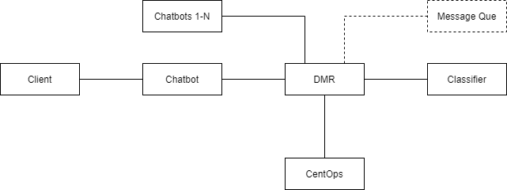

| Participant  | Description                                                                                                                                |
|--------------|--------------------------------------------------------------------------------------------------------------------------------------------|
| Client       | End-client´s browser, curl request or similar                                                                                              |
| Chatbot      | Client´s instance of Bürokratt chatbot service that in this example is used directly by Client                                             |
| Chatbots 1-N | Identical to "Chatbot" but is not used by Client in this example                                                                           |
| DMR          | Distributed Message Rooms (N number of them) pass on messages between different chatbot instances and Classifier. Dumb pipe by its nature. |
| CentOps      | Central Operating System controlled by Bürokratt´s core team to track and manage the whole ecosystem of Bürokratt                          |
| Classifier   | A stand-alone service to detect which participant is the correct one to process given (user) input                                         |
| Message Que  | Out of scope now, potentially valuable to store information about unsuccessful requests within the whole ecosystem                         |

# Management
## CentOps-related requests
<br>

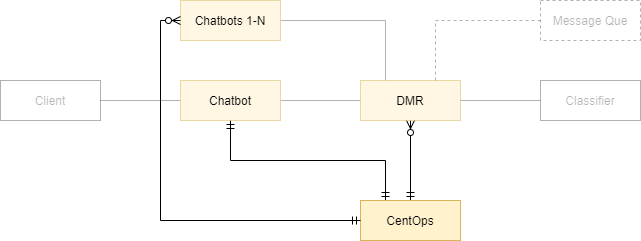

### Becoming a member of Bürokratt ecosystem
#### Request by Chatbot 

`https://byk.centops/register-chatbot`

```
{
	"client_information": ["name", "short_description", "institution"],
	"initial_verification_token_by_byk": "hash",
	"endpoints": ["public", "for_centops", "for_dmr"],
	"valid": ["from", "to"],
	"participation_in_ecosystem": ["common_cache_use_contribute", "federated_learning_use_contribute", "respond_to_third_party_requests"]
}
```

#### Request by DMR

`https://byk.centops/register-dmr`

```
{
	"client_information": ["name", "short_description"],
	"initial_verification_token_by_byk": "hash",
	"endpoints": ["public", "for_centops", "for_chatbots", "for_classifier"],
	"valid": ["from", "to"]
}
```

<!--
#### Response by CentOps

`https://private.chatbot/centops-notifications/participation-in-ecosystem`
`https://private.dmr/centops-notifications/participation-in-ecosystem`

```
{
	"request_id": "Hash generated and ping-ponged among Chatbot/DMR and CentOps",
	"response": ["in_progress", "accepted", "rejected"]
}
```
-->


### Reporting about planned outages
#### Request by Chatbot / DMR

`https://byk.centops/planned-outage-chatbot`
`https://byk.centops/planned-outagesuspend-dmr`

```
{
	"client_information": ["client_id", "reason_for_outage"],
	"valid": ["from", "to"]
}
```


### Suspending their participation in Bürokratt ecosystem
#### Request by Chatbot / DMR

`https://byk.centops/suspend-chatbot`
`https://byk.centops/suspend-dmr`

```
{
	"client_information": ["client_id", "reason_for_suspending"],
	"valid": ["from", "to"]
}
```


### Reporting about returning to Bürokratt ecosystem
#### Request by Chatbot / DMR

`https://byk.centops/return-chatbot`
`https://byk.centops/return-dmr`

```
{
	"client_information": ["client_id"]
}
```


### Removing themselves from Bürokratt ecosystem
#### Request by Chatbot / DMR

`https://byk.centops/remove-chatbot`
`https://byk.centops/remove-dmr`

```
{
	"client_information": ["client_id", "reason_for_suspending"]
}
```


### Request information about software updates

#### Request by Chatbot / DMR

> Different endpoints are used so that restricting access to them could be applied on server instead of application level

`https://byk.centops/list-software-updates/chatbot`
`https://byk.centops/list-software-updates/dmr`

```
{
	"list_componentes": ["*", "service.chatbot", "service.dmr", "ruuter", "dmapper", "xtr", "tim"]
}
```

> In case of using `service.` as a prefix, a container containing everything necessary to run a full-blown service is given. Otherwise, only specific components are covered.

#### Response by CentOps

```
{
	"ruuter": {
		"latest": "1.2.3",
		"latest_allowed": "1.2.0"
	}
}
```


### Sending aggregated logs to CentOps

These logs
    - can be used by every client to monitor their system´s health;
    - are used by CentOps to monitor the health of 

> Automated continuos process

`centops/accept-logs`

```
timestamp      component_version request_type         forwarded_id       request_id       request_to             response_code   response_in_ms
1646220981982  2.0.1             incoming.request     -                  NBZKMWMMMwm72Mvm -                       200             1
1646220981983  2.0.1             incoming.validation  NBZKMWMMMwm72Mvm   pLN3dUUNpmQUMLFr https://turvis          200             4
1646220981987  2.0.1             http.post            NBZKMWMMMwm72Mvm   VXpQqgQ3GzzS3cXs https://example.com/A   200             6
1646220981993  2.0.1             skip                 NBZKMWMMMwm72Mvm   -                -                       -               1
1646220981994  2.0.1             http.get             NBZKMWMMMwm72Mvm   zdpLqW7fRFAb98G9 https://example.com/C   418             2
1646220981996  2.0.1             incoming.response    NBZKMWMMMwm72Mvm   -                -                       200             -
```


## CentOps contacts Chatbot / DMR

> **_TO CLARIFY:_** On this image, "_many optional_ Chatbots 1-N" and "_exactly one_ Chatbot" are making requests to CentOps. Both "Chatbots 1-N" and "Chatbot" should actually be treated the same way but as we treat "Chatbot" separately throughout this document, such difference is used.

<br>

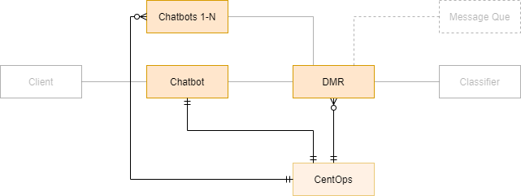

### CentOps notifies Chatbot / DMR about them being accepted as part of Bürokratt ecosystem

`https://private.chatbot/centops-notifications/participation-in-ecosystem`
`https://private.dmr/centops-notifications/participation-in-ecosystem`

```
{
	"request_id": "Hash generated and ping-ponged among Chatbot/DMR and CentOps",
	"response": ["in_progress", "accepted", "rejected"]
}
```


### CentOps notifies about the need to update software

`https://private.chatbot/centops-notifications/request-for-software-update`
`https://private.dmr/centops-notifications/request-for-software-update`

```
{
	"ruuter": {
		"urgency": "mandatory",
		"deadline": "2022-06-03T00:00:00+0000"
	},
	"xtr": {
		"urgency": "critical",
		"deadline": "2022-10-03T00:00:00+0000"
	}
}
```


### CentOps updates DMR with the list of chatbots

`https://private.dmr/centops-notifications/update-list-of-chatbots`

```
[{
		"participant": ["name", "description", "comments"],
		"labels": "Chatbot_A",
		"uri": "https://private.chatbot_a/message-from-dmr",
		"status": ["up", "down_unknown", "planned_outage"]
	},
	{
		"participant": ["name", "description", "comments"],
		"labels": "Chatbot_B",
		"uri": "https://private.chatbot_b/message-from-dmr",
		"status": ["up", "down_unknown", "planned_outage"]
	}
]
```

### CentOps updates DMR with the list of classifiers

`https://private.dmr/centops-notifications/update-list-of-chatbots`

```
[{
	"participant": ["name", "description", "comments"],
	"labels": "Classifier",
	"uri": "https://private.classifier/input-from-dmr/get-institution-name",
	"status": ["up", "down_unknown", "planned_outage"]
}]
```


### CentOps updates Chatbots and Classifiers with the list of DMRs

`https://private.chatbot/centops-notifications/update-list-of-dmrs`
`https://private.classifier/centops-notifications/update-list-of-dmrs`

> Having Classifier on the picture here although we are not covering it at the moment -- total mock for POC

```
[{
	"participant": ["name", "description", "comments"],
	"labels": "DMR_A",
	"uri": {
		"unclassified": "https://dmr/unclassified",
		"classified": "https://dmr/response-to-request"
	},
	"status": ["up", "down_unknown", "planned_outage"]
}]
```


# Chat flow
## Initial request from the Client
<br>

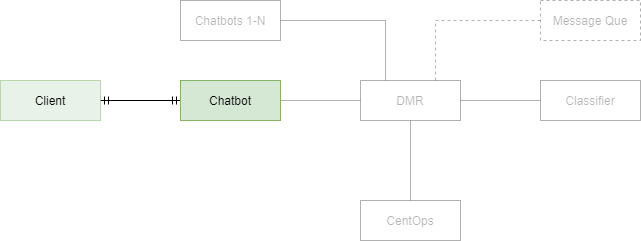

- Client sends a request to any member of Bürokratt´s ecosystem
- Client does not have to know which chatbot is the right one to answer him/her
- Client may ask about different intents within the same chat session knowing (or not) that this particular chatbot is not the one capable of responding
- Regardles of everything described above, the Client must still get a proper response to their request within this same chat session

### Request from Client to Chatbot

`https://private.chatbot/post-message`

```
{
	"message": "Standard"
}
```

## Chatbot unable to process the request
<br>

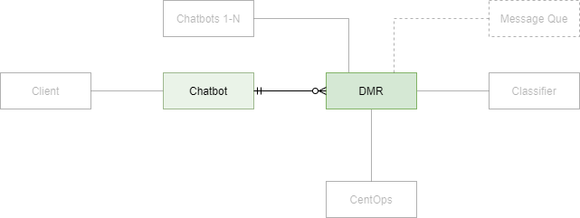

- A local Chatbot that the Client turned to is unable to find an appropriate answer
- In all such cases, an initial request is passed on to DMR which has to know what to do next

### Request from Chatbot to DMR

`https://dmr/unclassified`

```
{
	"callback_uri": "https://private.chat/chat-callback",
	"request_id": "J8EQMgzANpXA7gLnqMERcfcd",
	"payload": "ALLSAsnR4zJ42AyMQWFsq7q9AUvPrgqHHYRrAhxX35eh6QhTPJnbyX7wZW48KgSYaBcuBSEMycwRNbB4MgXpgCHXLuG4R38Z"
}
```

> `payload` can not be read by DMR

## DMR sends the request to Classifier
<br>

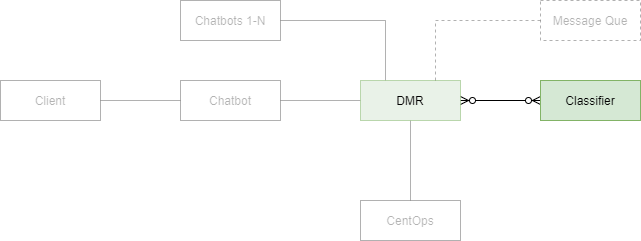

- If it´s an initial request (neither classified or responded by another bot), it always gets sent to Classifier

### Request from DMR to Classifier

`https://private.classifier/input-from-dmr/get-institution-name`

> Using `https://private.classifier/input-from-dmr/` instead of `https://private.classifier/` to have better ways to cover access control

```
{
	"callback_uri": "https://private.chat/chat-callback",
	"request_id": "J8EQMgzANpXA7gLnqMERcfcd",
	"payload": "ALLSAsnR4zJ42AyMQWFsq7q9AUvPrgqHHYRrAhxX35eh6QhTPJnbyX7wZW48KgSYaBcuBSEMycwRNbB4MgXpgCHXLuG4R38Z"
}
```

## Classifier responds with a name of a proper participant
<br>

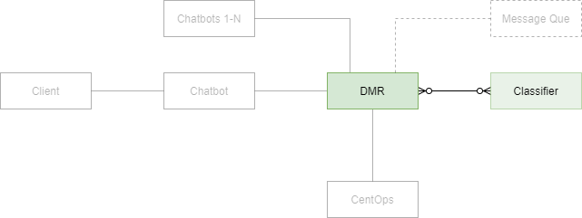

- Although Classifier is part of Bürokratt´s core services, it´s treated as a third-party service
- Classifier responds with a _name_ of the participant that should be able to respond to given request
- Classifier has no knowledge about what should or will be done with its response afterwards

> Classifier is able to read the content of `payload`

### Request from Classifier to DMR
`https://dmr/classified`

```
{
	"callback_uri": "https://private.chat/chat-callback",
	"request_id": "J8EQMgzANpXA7gLnqMERcfcd",
	"payload": "ALLSAsnR4zJ42AyMQWFsq7q9AUvPrgqHHYRrAhxX35eh6QhTPJnbyX7wZW48KgSYaBcuBSEMycwRNbB4MgXpgCHXLuG4R38Z",
	"institution": "Chatbot_A"
}
```

> In case of multiple institutions, Classifier makes separate requests for all of them

## DMR sends the request to proper participant
<br>

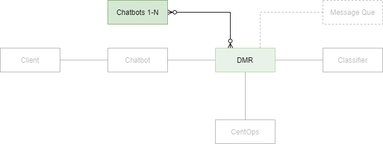

> CentOps continuously provides DMR information about which institution keywords (`Chatbot_A` = `https://private.chatbot_a/message-from-dmr` in this case) correspond to which endpoints

### Request from DMR to proper Chatbot
`https://private.chatbot_a/message-from-dmr`

```
{
	"callback_uri": "https://private.chat/chat-callback",
	"request_id": "J8EQMgzANpXA7gLnqMERcfcd",
	"payload": "ALLSAsnR4zJ42AyMQWFsq7q9AUvPrgqHHYRrAhxX35eh6QhTPJnbyX7wZW48KgSYaBcuBSEMycwRNbB4MgXpgCHXLuG4R38Z",
	"institution": "Chatbot_A"
}
```

> Classifier is able to read the content of `payload`


## Third-party chatbot responds to DMR
<br>

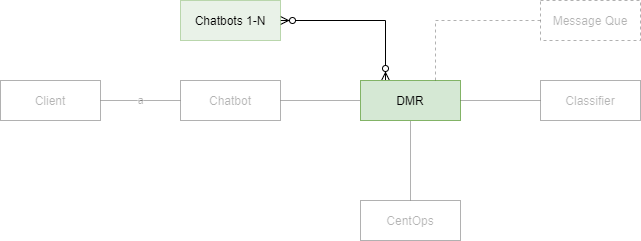

- Any third-party chatbot acts as any other chatbot would regardless of if they´re requested by an actual Client, DMR or something else
- As a request from Chatbot states a mandatori response URI (among other things), the response is sent to any of the DMRs currently active
- This response may take from milliseconds to days (or even more)

### Request from third-party chatbot to DMR
`https://dmr/response-to-request`

```
{
	"callback_uri": "https://private.chat/chat-callback",
	"request_id": "J8EQMgzANpXA7gLnqMERcfcd",
	"payload": "ALLSAsnR4zJ42AyMQWFsq7q9AUvPrgqHHYRrAhxX35eh6QhTPJnbyX7wZW48KgSYaBcuBSEMycwRNbB4MgXpgCHXLuG4R38Z",
	"response": {
		"by": "Chatbot_A",
		"content": "xxRTwTAtYZhNH52czKq5uVswRQesacUgQ5ASmQ2JRcB6ajEkAXTpYY6LGzWeEwW4SJT8TvsanAdggRNvgkNstqnz8LJq8uus"
	}
}
```

> `response.content` can not be read by DMR


## DMR responds to initial request
<br>

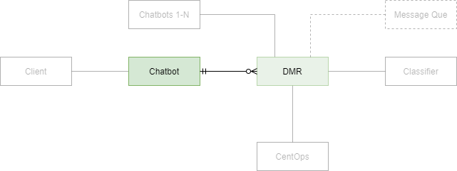

- DMR passes its response to Chatbot
- Business-wise, Chatbot treats responses from DMR the same way as it would treat its request to any of its backend services (local database for instance)

### Request from DMR to Chatbot that initiated this flow
`https://private.chat/chat-callback`

```
{
	"request_id": "J8EQMgzANpXA7gLnqMERcfcd",
	"payload": "ALLSAsnR4zJ42AyMQWFsq7q9AUvPrgqHHYRrAhxX35eh6QhTPJnbyX7wZW48KgSYaBcuBSEMycwRNbB4MgXpgCHXLuG4R38Z",
	"response": {
		"by": "Chatbot_A",
		"content": "xxRTwTAtYZhNH52czKq5uVswRQesacUgQ5ASmQ2JRcB6ajEkAXTpYY6LGzWeEwW4SJT8TvsanAdggRNvgkNstqnz8LJq8uus"
	}
}
```

> Request initiator (Chatbot) is able to read the content of `response.content`


## Response to Client
<br>

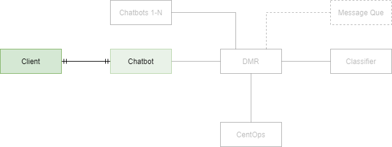

- Local chatbot passes the response to Client

### Response from Chatbot to Client

`https://private.chatbot/response`

```
{
	"response": {
		"by": "Chatbot_A",
		"content": "Response from a third party"
	}
}
```