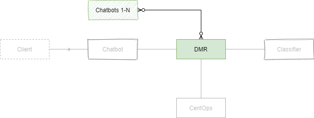

# Architecture design for DMR-related services

## Participants
 

| **Participant** | **Description**                                                                                                                             | **Scope of development**                     |
|-----------------|---------------------------------------------------------------------------------------------------------------------------------------------|----------------------------------------------|
| Client          | End-client`s browser, curl request or similar                                                                                               | curl requests or similar, no GUI nor backend |
| Chatbot         | Client`s instance of Bürokratt chatbot service that in this example is used directly by Client                                              | Mock; must push logs to CentOps              |
| Chatbots 1-N    | Identical to "Chatbot" but is not used by Client in this example                                                                            | Mock; must push logs to CentOps              |
| DMR             | Distributed Message Rooms (N number of them) pass on messages between different chatbot instances and Classifier; a dumb pipe by its nature | Actual working service (MVP)                 |
| CentOps         | Central Operating System controlled by Bürokratt`s core team to track and manage the whole ecosystem of Bürokratt                           | Actual working service (MVP)                 |
| Classifier      | A stand-alone service to detect which participant is the correct one to process given (user) input                                          | Mock                                         |                                 |

## Requests to CentOps
 

### Membership management

> `/membership-management/chatbots` and `/membership-management/dmrs` may be useful for clients themselves, for example to add an extra layer of monitoring, validation etc

| **Service**                                  | **Resource**                                | **Method** | **Requests from**        | **Requests to** | **OpenApi spec** |
|----------------------------------------------|---------------------------------------------|------------|--------------------------|-----------------|------------------|
| Get a list of all registered chatbots        | /membership-management/chatbots             | GET        | Chatbot, DMR, Classifier | CentOps         | _TBA_            |
| Register a membership of a new instance      | /membership-management/chatbots/{client-id} | POST       | Chatbot                  | CentOps         | _TBA_            |
| Update membership information of an instance | /membership-management/chatbots/{client-id} | PUT        | Chatbot                  | CentOps         | _TBA_            |
| Announce revoking membership                 | /membership-management/chatbots/{client-id} | DELETE     | Chatbot                  | CentOps         | _TBA_            |
| Get a list of all registered DMRs            | /membership-management/dmrs                 | GET        | DMR, Chatbot, Classifier | CentOps         | _TBA_            |
| Register a membership of a new instance      | /membership-management/dmrs/{client-id}     | POST       | DMR                      | CentOps         | _TBA_            |
| Update membership information of an instance | /membership-management/dmrs/{client-id}     | PUT        | DMR                      | CentOps         | _TBA_            |
| Announce revoking membership                 | /membership-management/dmrs/{client-id}     | DELETE     | DMR                      | CentOps         | _TBA_            |

### Status information

| **Service**                                       | **Resource**                 | **Method** | **Requests from**        | **Requests to** | **OpenApi spec** |
|---------------------------------------------------|------------------------------|------------|--------------------------|-----------------|------------------|
| Get status information of all registered chatbots | /status/chatbots             | GET        | Chatbot, DMR, Classifier | CentOps         | _TBA_            |
| Get status information of a specific chatbot      | /status/chatbots/{client-id} | GET        | Chatbot, DMR, Classifier | CentOps         | _TBA_            |
| Update status information of a specific chatbot   | /status/chatbots/{client-id} | PUT        | CentOps                  | CentOps         | _TBA_            |
| Get status information of all registered DMRs     | /status/dmrs                 | GET        | Chatbot, DMR, Classifier | CentOps         | _TBA_            |
| Get status information of a specific DMR          | /status/dmrs/{client-id}     | GET        | Chatbot, DMR, Classifier | CentOps         | _TBA_            |
| Update status information of a specific DMR       | /status/dmrs/{client-id}     | PUT        | CentOps                  | CentOps         | _TBA_            |

### Software management

| **Service**                                                       | **Resource**                                   | **Method** | **Requests from**        | **Requests to** | **OpenApi spec** |
|-------------------------------------------------------------------|------------------------------------------------|------------|--------------------------|-----------------|------------------|
| List all services provided by Bürokratt                           | /software-management/services                  | GET        | Chatbot, DMR, Classifier | CentOps         |                  |
| Update a list of all services provided by Bürokratt               | /software-management/services                  | PUT        | CentOps                  | CentOps         |                  |
| Get detailed technical information to run chatbot as a service    | /software-management/services/chatbot          | GET        | Chatbot, DMR, Classifier | CentOps         |                  |
| Update detailed technical information to run chatbot as a service | /software-management/services/chatbot          | PUT        | CentOps                  | CentOps         |                  |
| Get detailed technical information to run DMR as a service        | /software-management/services/DMR              | GET        | Chatbot, DMR, Classifier | CentOps         |                  |
| Update detailed technical information to run DMR as a service     | /software-management/services/DMR              | PUT        | CentOps                  | CentOps         |                  |
| List all technical components used to provide Bürokratt services  | /software-management/components                | GET        | Chatbot, DMR, Classifier | CentOps         |                  |
| Get detailed technical information about a specific component     | /software-management/components/{component-id} | GET        | Chatbot, DMR, Classifier | CentOps         |                  |
| Update detailed technical information about a specific component  | /software-management/components/{component-id} | PUT        | CentOps                  | CentOps         |                  |

### Planned outages

| **Service**                                      | **Resource**                              | **Method** | **Requests from**        | **Requests to** | **OpenApi spec** |
|--------------------------------------------------|-------------------------------------------|------------|--------------------------|-----------------|------------------|
| Get a list of all planned outages                | /services-management                      | GET        | Chatbot, DMR, Classifier | CentOps         |                  |
| Update a list of all planned outages             | /services-management                      | PUT        | CentOps                  | CentOps         |                  |
| Get a list of all planned outages of chatbots    | /services-management/chatbots             | GET        | Chatbot, DMR, Classifier | CentOps         |                  |
| Update a list of all planned outages of chatbots | /services-management/chatbots             | PUT        | CentOps                  | CentOps         |                  |
| Get planned outages of a specific chatbot        | /services-management/chatbots/{client-id} | GET        | Chatbot, DMR, Classifier | CentOps         |                  |
| Notify about a planned outage                    | /services-management/chatbots/{client-id} | POST       | Chatbot                  | CentOps         |                  |
| Update planned outages for a specific chatbot    | /services-management/chatbots/{client-id} | PUT        | CentOps                  | CentOps         |                  |
| Get a list of all planned outages of DMRs        | /services-management/dmrs                 | GET        | Chatbot, DMR, Classifier | CentOps         |                  |
| Notify about a planned outage                    | /services-management/chatbots/{client-id} | POST       | DMR                      | CentOps         |                  |
| Update a list of all planned outages of DMRs     | /services-management/chatbots/{client-id} | PUT        | CentOps                  | CentOps         |                  |

### Sending logs

| **Service**                                 | **Resource** | **Method** | **Requests from**        | **Requests to** | **OpenApi spec** |
|---------------------------------------------|--------------|------------|--------------------------|-----------------|------------------|
| Send aggregated logs for central monitoring |              |            | Chatbot, DMR, Classifier | CentOps         |                  |

## Requests by CentOps

> **_TO CLARIFY:_** On this image, "_many optional_ Chatbots 1-N" and "_exactly one_ Chatbot" are making requests to CentOps. Both "Chatbots 1-N" and "Chatbot" should actually be treated the same way but as we treat "Chatbot" separately throughout this document, such difference is used.

 

| **Service**                                                            | **Resource**                                         | **Method** | **Requests from** | **Requests to**          | **OpenApi spec** |
|------------------------------------------------------------------------|------------------------------------------------------|------------|-------------------|--------------------------|------------------|
| Membership registration accepted                                       | /centops-communication/registrations/{client-id}     | POST       | CentOps           | Chatbot, DMR, Classifier |                  |
| Notify participants about having updated information regarding to them | /centops-communication/published-updates/{client-id} | POST       | CentOps           | Chatbot, DMR, Classifier |                  |
| Notify participants about optional software updates                    | /centops-communication/software-updates/optional     | POST       | CentOps           | Chatbot, DMR, Classifier |                  |
| Notify participants about mandatory software updates                   | /centops-communication/software-updates/mandatory    | POST       | CentOps           | Chatbot, DMR, Classifier |                  |
| Notify participants about critical software updates                    | /centops-communication/software-updates/critical     | POST       | CentOps           | Chatbot, DMR, Classifier |                  |
| Update the list of chatbots                                            | /centops-communication/participants/chatbot          | POST       | CentOps           | DMR                      |                  |
| Update the list of DMRs                                                | /centops-communication/participants/dmr              | POST       | CentOps           | Chatbot                  |                  |               |

# Chat flow
## Initial request from the Client
 

- Client sends a request to any member of Bürokratt`s ecosystem
- Client does not have to know which chatbot is the right one to answer him/her
- Client may ask about different intents within the same chat session knowing (or not) that this particular chatbot is not the one capable of responding
- Regardles of everything described above, the Client must still get a proper response to their request within this same chat session

## Chatbot unable to process the request
 

- A local Chatbot that the Client turned to is unable to find an appropriate answer
- In all such cases, an initial request is passed on to DMR which has to know what to do next

> DMR is unable to read the content of `payload`

## DMR sends the request to Classifier
 

- If it`s an initial request (neither classified or responded by another bot), it always gets sent to Classifier

> DMR is unable to read the content of `payload`

## Classifier responds with a name of a proper participant
 

- Although Classifier is part of Bürokratt`s core services, it`s treated as a third-party service
- Classifier responds with a _name_ of the participant that should be able to respond to given request
- Classifier has no knowledge about what should or will be done with its response afterwards

> Classifier is able to read the content of `payload`

> In case of multiple institutions, Classifier makes separate requests for all of them

## DMR sends the request to proper participant
 

> CentOps continuously provides DMR information about which institution keywords (`Chatbot_A` = `https://private.chatbot_a/message-from-dmr` in this case) correspond to which endpoints

> DMR is unable to read the content of `payload`

## Third-party chatbot responds to DMR
 

- Any third-party chatbot acts as any other chatbot would regardless of if they`re requested by an actual Client, DMR or something else
- As a request from Chatbot states a mandatori response URI (among other things), the response is sent to any of the DMRs currently active
- This response may take from milliseconds to days (or even more)

> DMR is unable to read the content of `payload`

## DMR responds to initial request
 

- DMR passes its response to Chatbot
- Business-wise, Chatbot treats responses from DMR the same way as it would treat its request to any of its backend services (local database for instance)

> DMR is unable to read the content of `payload`

> Request initiator (Chatbot) is able to read the content of `response.content`

## Response to Client
 

- Local chatbot passes the response to Client
