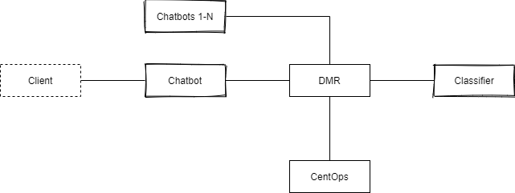

# Technical design for DMR-related services

## Participants
 

| **Participant** | **Description**                                                                                     | **Technical stack**                                                              | **Scope of development**                                                                                       | **Comments**                                                                                                                    |
|-----------------|-----------------------------------------------------------------------------------------------------|----------------------------------------------------------------------------------|----------------------------------------------------------------------------------------------------------------|---------------------------------------------------------------------------------------------------------------------------------|
| Client          | End-client talking to a chatbot                                                                     | curl requests                                                                    | No development                                                                                                 |                                                                                                                                 |
| Chatbots        | - GUI for end-clients  - Voice input in the future                                               | .NET                                                                             | - Mock  - No need for actual GUI                                                                            | - Will be later replaced with actual bots  - Will later have load balancers in front of them  - N number of instances     |
| DMR             | A well-orchestrated high-performance dumb pipe acting as a proxy pass.                              | Nginx                                                                            | - Ready to use in production  - Must pass penetration testing  - Gets its input for updates from CentOps | - Core component of BYK-stack  - Distributed orchestrator of messages within Bürokratt ecosystem  - N number of instances |
| Classifier      | - Uses raw text as input  - Names the participant(s) most likely to be the right ones to respond | .NET                                                                             | Mock                                                                                                           | - Will be later replaced with actual Classifier(s)  - Potentially many endpoints / service providers                         |
| CentOps         | Notifies all participants of ecosystem about technical updates                                      | ?                                                                                | - Ready to use in production  - Must pass penetration testing                                               | - Everything related to administrating the members of Bürokratt ecosystem  - Software updates                                |
|                 | Accepts and processes raw logs of participants                                                      | - Logstash at participants  - Opensearch / Cosmos DB to store data at CentOps | - Ready to use in production  - Must pass penetration testing                                               | Raw logs of participants are the basis for  - client-specific monitoring and actions based on that  - general statistics  |
